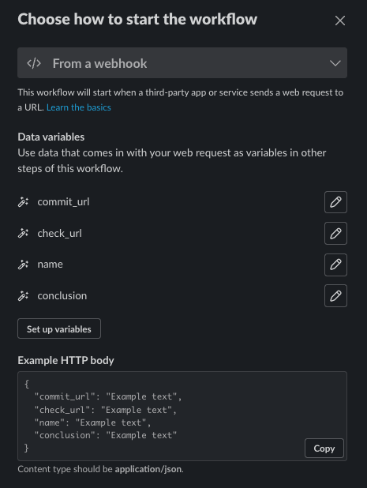

# slack-notifier

Slack Notifier listens to check statuses and reports the failures via Slack.

## Installation

### Slack

You will need to create a new integration via the workflow builder. It needs to be triggered from a webhook and the
payload needs to be in the following format:

- commit_url: string - The URL to the commit that was checked
- check_url: string - The URL to the check that was run
- name: string - The name of the check that was run
- conclusion: string - The conclusion of the check that was run



You can then customise the message that is sent.

### Github Workflow

You will need to add a new workflow to your repository. The following is an example of a workflow that will run the
notifier on every check run.

```yaml
name: "Slack Notifier"
on:
  pull_request:

jobs:
  notifier:
    runs-on: [ ubuntu-latest ]
    name: "Slack Notifier"
    permissions: read-all
    steps:
      - name: "Checkout"
        uses: actions/checkout@v2
      - name: "Slack Notifier"
        uses: baely/slack-notifier@main
        with:
          github_token: ${{ secrets.GITHUB_TOKEN }}
          github_repo: ${{ github.REPOSITORY }}
          commit_sha: ${{ github.EVENT.AFTER }}
          slack_webhook: ${{ secrets.SLACK_WEBHOOK }}
          required_checks: "Check One, Check Two"
```
